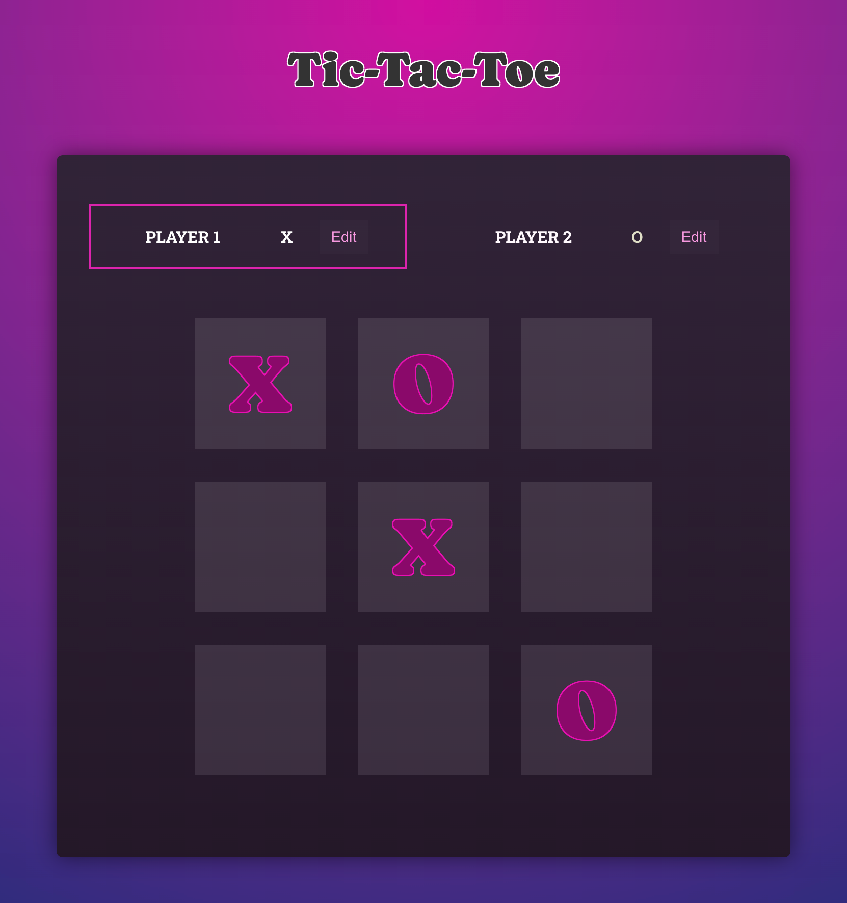

<a name="readme-top"></a>

<!-- PROJECT TITLE -->
<br />
<div align="center">
  <h3 align="center">Tic-Tac-Toe Game</h3>
  <p align="center">
    Creating a Tic-Tac-Toe game using the React library.
  </p>
</div>

<!-- TABLE OF CONTENTS -->
<details>
  <summary>Table of Contents</summary>
  <ol>
    <li>
      <a href="#about-the-project">About The Project</a>
      <ul>
        <li><a href="#built-with">Built With</a></li>
      </ul>
    </li>
    <li>
      <a href="#getting-started">Getting Started</a>
      <ul>
        <li><a href="#prerequisites">Prerequisites</a></li>
        <li><a href="#installation">Installation</a></li>
      </ul>
    </li>
  </ol>
</details>

<!-- ABOUT THE PROJECT -->
## About The Project

<div align="left">

</div>
<br>
The purpose of the project was to learn React. Understand the basics with  a simple file structure, using hooks and the integration of parent and child components including how data is passed between them.

### Built With

- [![React][React.js]][React-url]
- ![JavaScript][JavaScript.js]
- [![SASS][SASS]][SASS-url]

<p align="right">(<a href="#readme-top">back to top</a>)</p>

<!-- GETTING STARTED -->
## Getting Started

To get a local copy up and running follow these simple example steps.

### Prerequisites

NodeJs and Node Package Manager (NPM) should be installed. This can be downloaded and installed from [nodejs.org](https://nodejs.org/en/download).

### Installation

1. Clone or download the repo
   ```sh
   git clone https://github.com/a-g-ross/react-tic-tac-toe.git
   ```
2. Install NPM packages
   ```sh
   npm install
   ```
3. Run site
   ```sh
   npm run dev
   ```

<p align="right">(<a href="#readme-top">back to top</a>)</p>

<!-- MARKDOWN LINKS & IMAGES -->
[React.js]: https://img.shields.io/badge/React-20232A?style=for-the-badge&logo=react&logoColor=61DAFB
[React-url]: https://reactjs.org/
[JavaScript.js]: https://img.shields.io/badge/javascript-%23323330.svg?style=for-the-badge&logo=javascript&logoColor=%23F7DF1E
[SASS]: https://img.shields.io/badge/SASS-hotpink.svg?style=for-the-badge&logo=SASS&logoColor=white
[SASS-url]: https://sass-lang.com